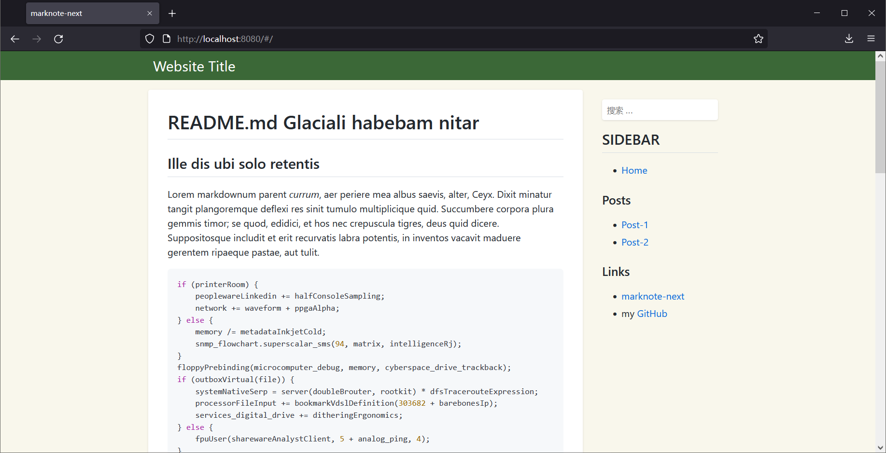

# docutil

<div style="text-align: center; margin: 20px">
    <p></p>
    <p>docutil 是一个纯前端的网站应用，由 rust、javascritp 共同驱动</p>
</div>


## 效果



[预览](https://lambdadriver.space/)

## 特性

- [x] 纯前端渲染
- [x] hash 风格路由
- [x] 内置自适应主题
    - [x] 打印优化
    - [x] 移动端支持
- [x] 全文搜索支持
    - [x] 独立的[搜索 API](https://github.com/yuekcc/marknote-search-mvp)
- [x] 支持自定义网站 title、footer 信息
- [x] 支持二级目录部署（https://example.com/mysite）

## 生态

- [全文搜索](https://github.com/yuekcc/marknote-search-mvp)
    - MVP 版
    - 基于 meilisearch 实现的全文搜索（[介绍](https://lambdadriver.space/#/docs/202111/full-text-search-for-marknote.md)）
- [webhook](https://github.com/yuekcc/docutil-deploy-hook)
    - 用于 gitops 的 webhook 服务。通过 github 等代码托管服务的 webhook 功能，实现自有服务器的网站更新。

## 部署

docutil 可以部署在自有服务器或 github pages 服务（或相似的服务），只要求基本静态文件服务支持。

docutil 按约定大于配置原则，文件布局如下：

```sh
/-------  # 根目录
    |-- docs/ # 文章目录
    |-- images/ # 图片等文件目录
    |-- dist/ # docutil 文件目录（index.mjs、index.css、web_bg.wasm）
    |-- index.html # 网站入口
    |-- README.md # 主页内容
    |-- SIDEBAR.md # 侧栏内容
```

`index.html` 是网站的主入口，可以在 body 标签是增加下面的代码，用于配置网站的页脚、入口、标题。

```html
<script>
window.config = {
    title: 'Website Title',
    root: '/',
    footer: `[Footer](http://github.com/yuekcc)`,
};
</script>
```

可以参考[示例](loader/index.html)。

## License

[MIT](LICENSE)
